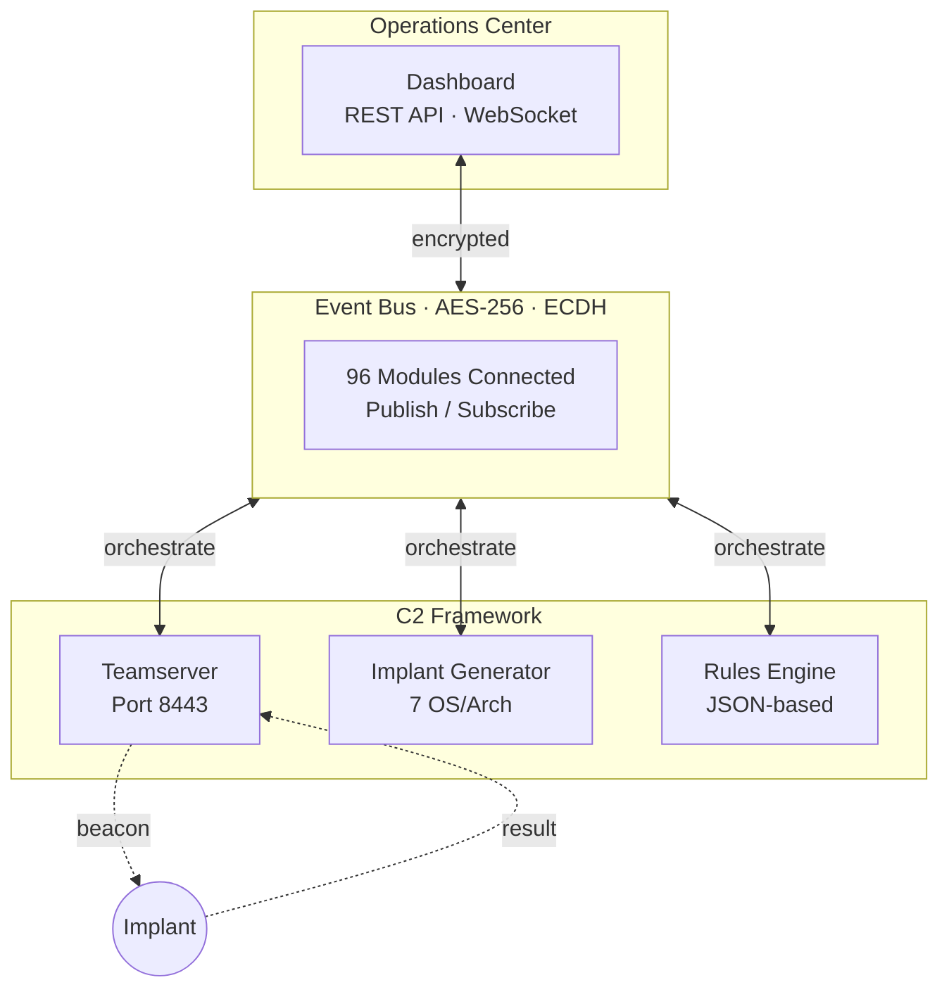

# ANGEL

<p align="center">
  
</p>

<p align="center">
  
</p>

<p align="center">
  <a href="https://github.com/AngelAchel/ANGEL/actions/workflows/ci.yml"></a>
  <a href="LICENSE"></a>
  <a href="https://golang.org"></a>
</p>

> **ANGEL** — Offensive security framework for **authorized** penetration testing and red team engagements. 70-layer attack surface with real-time cross-module event bus orchestration.

---

## Why ANGEL

Most offensive frameworks are monolithic — one implant, one protocol, one point of failure. ANGEL is **event-driven by design**: 96 modules communicate through an encrypted event bus, enabling parallel operations, fallback chains, and adaptive behavior across the full offensive lifecycle.

- **Modular** — Every layer runs independently, orchestrated by the event bus
- **Resilient** — Automatic fallback chains when techniques are detected or blocked
- **Encrypted** — AES-256 on all channels, ECDH key exchange
- **Evidence-first** — Full chain-of-custody logging for compliance reports
- **Cross-platform** — Linux, Windows, macOS (amd64/arm64)

---

## Quick Start

### Prerequisites

- Go 1.25+
- Node.js 20+
- Docker & Docker Compose
- Git

### Install

```bash
git clone https://github.com/AngelAchel/ANGEL.git
cd ANGEL
cp .env.example .env.local
make build && make test && make lint
```

### Deploy with Docker (Recommended)

```bash
echo "192.168.1.0/24" > target.txt
make engage SCOPE=target.txt
```

Services start automatically:

| Service | Port | Purpose |
|---------|------|---------|
| `angel-teamserver` | `8443` | C2 server with encrypted channels |
| `angel-console` | `3000` | Dashboard & API gateway |
| `angel-rules` | — | Rules engine (one-shot) |
| `dvwa` | `8081` | Practice target environment |

Open the dashboard: **http://localhost:3000**

### Native Deployment (Kali Linux)

```bash
CGO_ENABLED=0 make build
bash scripts/start-local.sh
bash scripts/health-check.sh
```

---

## Usage

### Generate Implant

```bash
./bin/angel-generate -os linux -arch amd64 -server http://localhost:8443 -out lab/implants
./bin/angel-generate -os windows -arch amd64 -server https://target.com -evasion domain-fronting
```

### Define Scope and Engage

```bash
echo "192.168.1.0/24" > target.txt
make engage SCOPE=target.txt
```

### Cleanup

```bash
make cleanup
```

---

## Architecture



### Layer Coverage

ANGEL spans 70 layers across 9 operational domains:

```
Layers 01–05   Recon · C2 Implant · Listener · Database Post-Exploit · Resilience
Layers 06–10   Evasion · AD Attack · Lateral Movement · Persistence · Rootkit
Layers 11–15   Credential · Collector · Destruction · Orchestrator · Brain
Layers 16–21   Infrastructure · OSINT · Exploitation · Evidence · Reporting · Cleanup
Layers 22–25   Auth Bypass · Network Evasion · Destruction Chain · Implant Generator
Layers 26–40   AI · Cloud · Mobile · Supply Chain · Wireless · Zero Trust
Layers 41–60   Web Exploitation · Network Attacks · SCADA · IoT · Compliance
Layers 61–70   Memory Corruption · Deserialization · Race Condition · GraphQL · gRPC
```

---

## Capabilities

| Phase | Coverage |
|-------|----------|
| **Reconnaissance** | OSINT, network enumeration, service discovery, vulnerability mapping |
| **Initial Access** | C2 implant delivery, phishing, supply chain, credential stuffing |
| **Execution** | Command execution, script injection, memory-resident payloads |
| **Persistence** | Scheduled tasks, registry hooks, service installation, rootkit |
| **Privilege Escalation** | Kernel exploits, token manipulation, ACL abuse, credential dumping |
| **Defense Evasion** | Anti-analysis, anti-debug, sleep masking, syscall obfuscation |
| **Credential Access** | LSASS, browser wallets, VPN tokens, MFA bypass, biometric |
| **Discovery** | Domain recon, user enumeration, share scanning, subnet mapping |
| **Lateral Movement** | SMB, RDP, WinRM, SSH, WMI, Pass-the-Hash, Pass-the-Ticket |
| **Collection** | Filesystem, email, browser history, keylogger, screen capture |
| **Exfiltration** | Encrypted channels, DNS tunneling, HTTP(S) covert, cloud storage |
| **Impact** | Data destruction simulation, ransomware simulation, service disruption |

---

## Make Targets

| Target | Description |
|--------|-------------|
| `make build` | Build all binaries (teamserver, console, rules, generate, doctor) |
| `make test` | Run all test suites |
| `make lint` | golangci-lint, staticcheck, go vet, errcheck |
| `make report` | Generate HTML engagement report |
| `make setup` | Initialize environment, copy `.env.local` |
| `make engage` | Start Docker services with target scope |
| `make cleanup` | Stop and remove all containers |
| `make doctor` | Verify system compatibility |

---

## Security & Compliance

- **Authorized use only** — ANGEL is designed for penetration testing with explicit written authorization
- **No hardcoded credentials** — All secrets loaded from environment configuration
- **End-to-end encryption** — AES-256 on all C2 channels, ECDH key exchange
- **Event bus isolation** — Module communication via encrypted event bus, no direct imports
- **Audit logging** — Full chain-of-custody logging for compliance reports

---

## Documentation

- **[USAGE_GUIDE.md](USAGE_GUIDE.md)** — Complete operational guide
- **[STRUKTUR_ANGEL.md](STRUKTUR_ANGEL.md)** — Full architecture blueprint (70 layers)
- **[docs/API.md](docs/API.md)** — API reference
- **[docs/PRODUCTION.md](docs/PRODUCTION.md)** — Production deployment guide
- **[docs/NATIVE-RUN.md](docs/NATIVE-RUN.md)** — Native Linux setup

---

## License

This project is licensed under the MIT License — see [LICENSE](LICENSE) for details.

ANGEL is intended for **authorized security professionals** conducting penetration tests and red team operations. Unauthorized use is illegal.

---

<p align="center">
  
  <br>
  <sub>70 Layers · 96 Modules · Event-Driven · For Authorized Use Only</sub>
</p>
